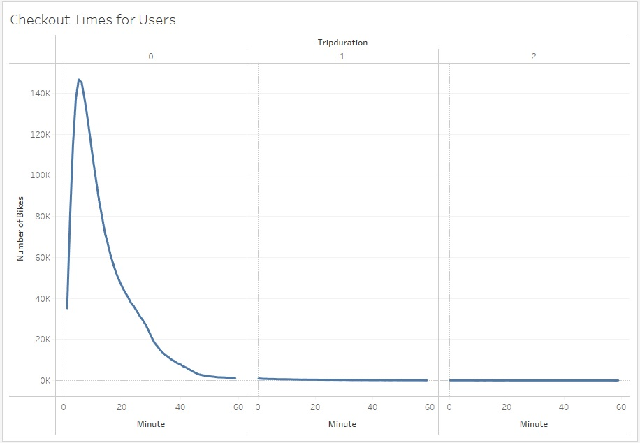
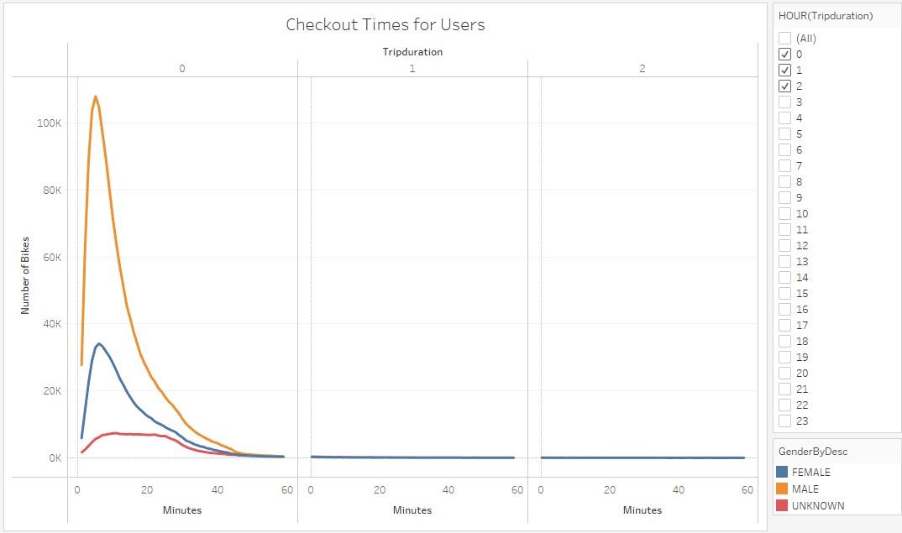
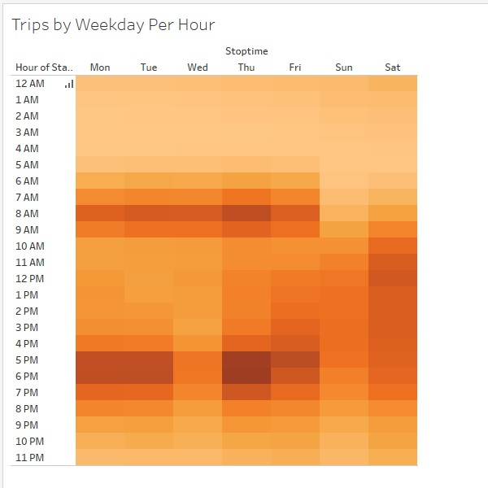
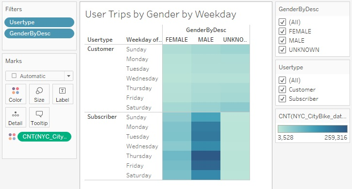
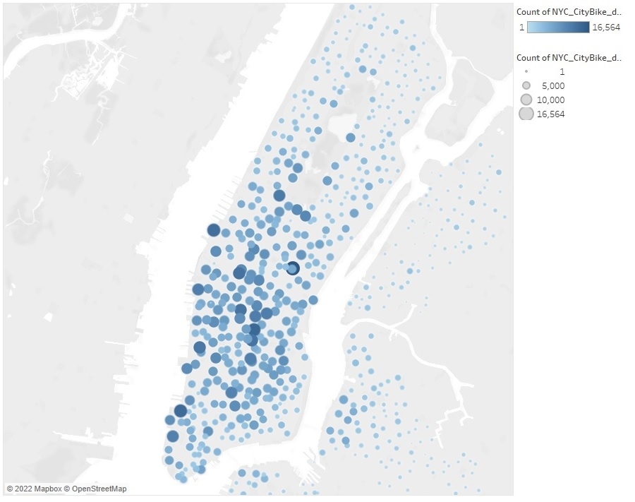
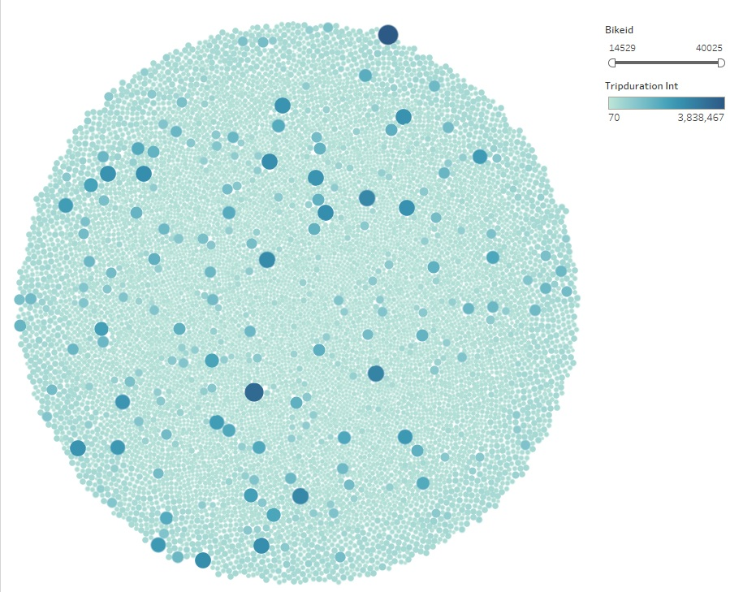

# NYC CitiBike
Module 15 Challenge - Data Visualization using Tableau

## Overview
Using historical data from a bikeshare company in NYC and their historical data, we used this as a data sample to build a few visualizations using Tableau to help convince potential investors that creating their own BikeSharing company would be a good idea. We will use Tableau to create the following display: 
* The length of time that bikes are checked out for all riders and genders.
* The number of bike trips for all riders and genders for each hour of each day of the week.
* The number of bike trips for each type of user and gender for each day of the week.

## Deliverable 1: Change Trip Duration to a Datetime Format
Using Jupyter notebook the dataset is imported from a CSV file into a dataframe. The dataframe then confirms that the information was imported correctly. Using the below script the specific column is switched from int64 to datatime64: 
```
# 3. Convert the 'tripduration' column to datetime datatype.
citibike_df['tripduration'] = pd.to_datetime(citibike_df['tripduration'], unit='s')
```
The cleaned data is then exported to the file "NYC_CityBike_data_cleaned.csv". 
Note: Due to file size limitations a copyof this file was not uploaded to the Github challenge repsitory.

[NYC_CitiBike_Challenge](/NYC_CitiBike_Challenge.ipynb)

## Deliverable 2: Create Visualizations for the Trip Analysis
Using Tableau, the following Visualizations were created to display:  
* How long bikes are checked out for all riders and genders.
* How many trips are taken by the hour for each day of the week, for all riders and genders.
* A breakdown of what days of the week a user might be more likely to check out a bike, by type of user and gender.

### Create the Checkout Times for Users Viz

This graph depicts the length of time (in hours) that the bikes are checked out for all users. Most of the bikes are checked out for less than 1 hour with a much smaller percentage being checked out for greater than 2 hours. Because there is such a large trend for quick rentals it appears that the bikes are not being moved across town. Setting a good location of where the bikes are located will ensure they are constantly being used.

</br>

###Create the Checkout Times by Gender Viz
 
In this visualization, the vast number of bike checkouts by males vs female and unknowns by at least 3 to 1. This information can be used to help target male customers and another focused marketing opportunity can be used to help attract more female riders.

</br>

### Create the Trips by Weekday for Each Hour Viz

This is the first of a few heatmaps used to display what times the bikes are used and the days when the most usage occur. Most of the usage between Monday - Friday during "commuter hours", between 6 AM and 9AM. The next is between 4PM to 8PM. The weekend times shift to more general tourist times. For Saturday the usage is between 9AM and 7PM and on Sunday the peak usage occurs between 11AM to 5PM.

</br>

### Create the Trips by Gender (Weekday per Hour) Viz

This utilization heatmap displays a lower level of usage by female vs Males users. The timeframes are still the same with Mon - Fri usage during commuter hours and a little usage by females during the same timeframe. 

</br>

### Create the User Types by Gender by Weekday Viz

Using this heatmap breakdown of service subscribers vs non subscribers and gender can help marketing identify which groups might use the services the most. Usage for subscribers vs non subscribers is higher across the board with Males leading the most consistent usage vs females.

</br>

## Deliverable 3: Create a Story and Report for the Final Presentation

The story I created using Tableau has a few slides. The first slide provides a map which details the starting trip locations for all the bikes available for rent. Most are located around the downtown are of NYC with a few of the other rides being spread out in other boroughs. This information can be extrapolated for areas where investors want to use this service to determine where the largest inventory of bikes should be stationed. The denser the metropolitan area the higher the possibility of usage. 

</br>

The next slide shows the usage of each bike for the bikeshare company. There are a few bikes which have a lot of usage whereas other bikes have less usage. This can be a large part of where the bikes tend to be used which creates a higher amount of usage depending on starting and ending points. Knowing which bikes have the highest amount of usage can help with maintenance schedules along with ensuring the bikes remain in service for usage.

</br>
